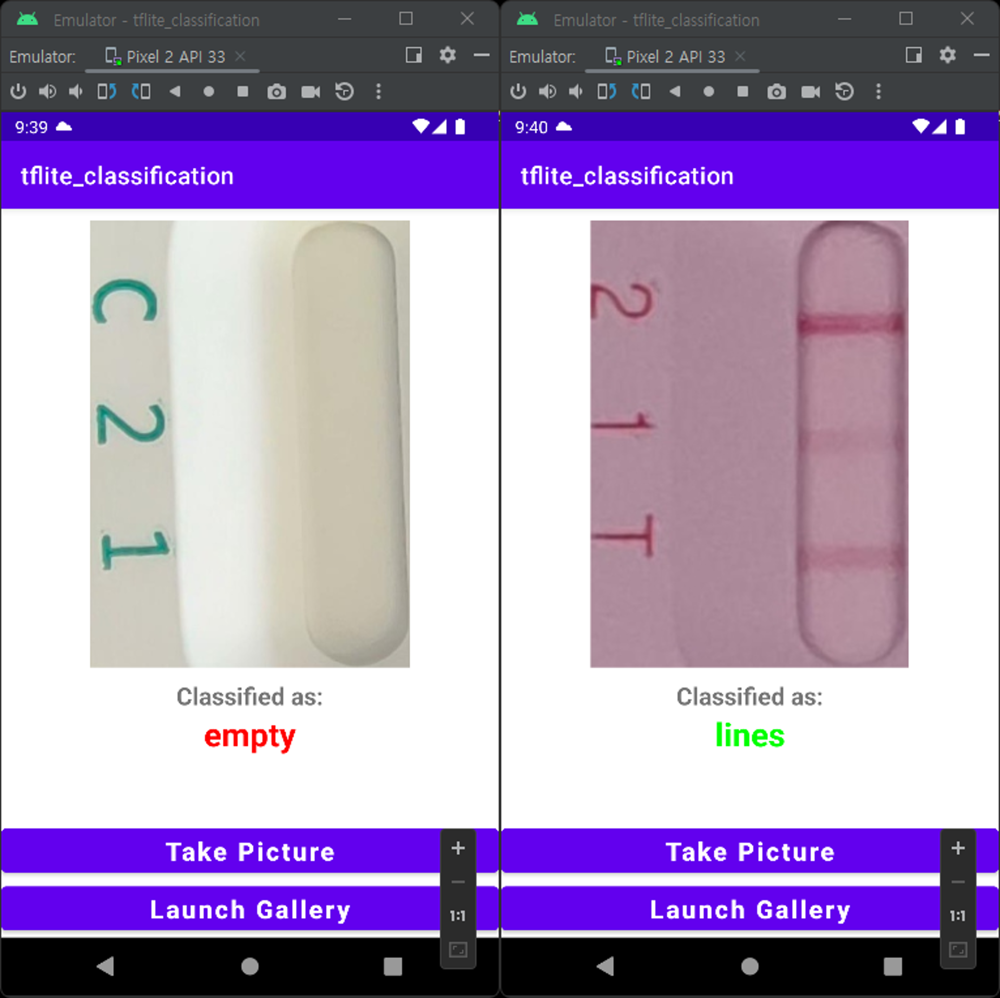

# Tflite_classification

The tflite_classification is an application that determines the presence or absence of a test line in the kit model. The reason for creating this application is that, at the request of Proteometech, it was discovered that the Kit-aid application predicts the concentration of antibodies even when there is no test line. Therefore, by performing this task before entering the regression model, it ensures that if there is no test line, it does not enter the regression model.

## Badges

 

## Screenshots

## References
- https://www.youtube.com/watch?v=yV9nrRIC_R0
- https://developer.android.com/training/basics/intents/result